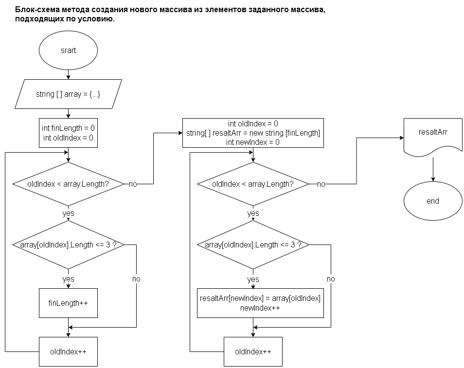

# Итоги блока. Контрольная работа

## Задача

*Написать программу, которая из имеющегося массива строк формирует массив из строк, длина которых Меньше либо равна 3 символа. Первоначальный массив можно ввести с клавиатуры, либо задать на старте выполнения алгоритма. При решении не рекомендуется пользоваться коллекциями, лучше обойтись исключительно массивами.*

## Решение

Блок-схема на рисунке ниже описывает метод создания нового массива из элементов задданого, проходящих по условию:
* _**Количество символов в строке меньше или равно 3**_

В ходе решения мы в первый раз в цикле обходим каждый элемент заданного массива проверяя на соответствие условию, если соответствует, то увеличиваем переменную длинны нового массива на единицу.

Создаем массив найденной длинны.

Снова обходим в цикле каждый элемент заданного массива, проверяя тоже условие. Теперь если соответствует, то записываем значание в новый массив и увеличиваем индекс на единицу.

Возвращаем новый массив))

Исходный массив задаю в самом коде. 

Для проверки вывожу в консоль исходный массив и новый используя интерполяцию и метод *string. Join*.

## Хорошо, что аж слишком))

Стараясь избавиться от повторения кода, от той части где массив прогоняется два раза практически одинаково, открыл для себя технологию **LINQ**.

Ремение этим способом записанно в коммите "add LINQ".

Фантазии сделать блок схему для данного способа у меня не хватило) если это вообще возможно.

